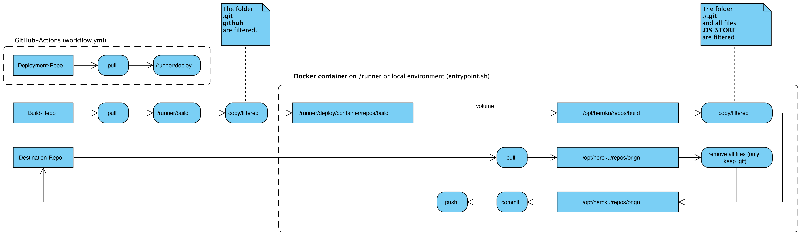

# About: app-solo-deploy-heroku  
Artifact repository for direct deploy to Heroku Git with GitHub Actions.  
Deploy your code to the Heroku Git as described here: https://devcenter.heroku.com/articles/git  

# The workflow  
This is a deployment workflow, which can be run in two different ways.  
It relies on a previous process or workflow which build/collect/assembles your files into one place: an artifact or an repository.  
This workflow starts from this point it downloads an build-artifact from your GitHub-Actions workflwo or pulls a build from a repository.  

You have to choose between these two ways of pluging in this artifact.  

## A) __Use an deployment artifact__ from GitHub-Actions (commented)  
Your previous process created an build artifact within your GitHub-Actions-Workflow. The name of your __artifact__ must be set with the var __DEPLOY_ARTIFACT__ in the workflow file. The build artifact get automatically downloaded into the __BUILD_FILES_FOLDER__ folder.  
Note: Files __'.DS_Store'__ will be deleted automatically in the build and the orign folder. If this behavior is uncomfortable you have to edit the entrypoint.sh file.  

## B) __Check-out an deployment repo__ (default)
Set the var __DEPLOY_REPO__ with your repositories name like <owner>/<repo>. 
Your repo gets cloned and in the second step all files within this folder will be replaced with your build files. __So your build has to be complete!__  

There will be __only one commit__ which replaces all files with the new build.  

The following graphic gives an overwiev whats happening

## Trigger this workflow    
The deployment workflow is trigged by __pushing to your main/master branch__ or by an __WebHook__.  

### WebHook  
You need a Personal-Access-Token (PAT) in your GitHub-Repo with "repo"-scope.  
Store this Token as a GitHub-Secret __"PAT_GITHUBWEBHOOK"__.  

Use the following code at the end of another/previous workflow to trigger this workflow (replace <repo-owner> and <repo> with your names):  

    curl \
    -X POST \
    -H "Accept: application/vnd.github.v3+json" \
    -H 'authorization: Bearer ${{ secrets.PAT_GITHUBWEBHOOK }}' \
    https://api.github.com/repos/<repo-owner>/<repo>/dispatches \
    -d '{"event_type":"build-ready-to-deploy"}'

# Structure of this repo

    +-- ./
    |   +-- .github
    |   |   +-- actions
    |   |   |   +-- heroku
    |   |   |   |   +-- deploy-to-heroku
    |   |   +-- images
    |   |   |   +-- heroku-deploy  
    |   |   +-- workflows
    |   +-- container
    |   |   +-- repos
    |   |   |   +-- build
    |   |   |   +-- orign
    |   |   +-- ssh
    |   +-- data  
    |   |   +-- configs
    |   |   +-- envs  

# Setup  
## Read the comments in workflow.yml first!  
Start with the workflow.yml stored in ./.github/workflows.  

1) Set your repo where the build is stored in __BUILD_REPO__  
2) Create an __.env__ or __set GitHub-secrets__ as described below.  

## Working with GitHub Secrets  
You can omit using an env file with encryption in your repository.  
Therefore you can store sensitive information as secrets in GitHub.  

* AUTOMATION_SECRET: _Stores the passphrase for your encrypted files in your repo (i.e. encrypted .env-files)_
* HEROKU_APP_NAME: _Stores the app name on Heroku (needed for interaction over Heroku CLI)_
* HEROKU_API_KEY: _Stores the token for accessing the Heroku API from Heroku CLI_  
* HEROKU_DEPLOY_MAIL: _Stores a mail address, which will be used for your 'automatic' git user (during deployment)_
* HEROKU_DEPLOY_USER: _Stores the user name, which will be used for your 'automatic' git user (during deployment)_
* PAT_GITHUBACTIONS: _Stores the personal access token (PAT) of your source repository (where the build is pulled from)_

## Working with an env file  
Create a __global .env file__ next to your docker-compose.yml.  
The vars you have to define for your local setup are already declared in ./.github/workflows -> __copy them into your .env__.  

### Further vars in your global env  

    # for local usage, see: workflow.yml for deployment with GitHub-Actions
    HEROKU_API_KEY=<your-api-key>
    HEROKU_APP_NAME=<your-app-name>
    
    # set true if your commit should run in dry-run mode (for debugging/testing)
    DRY_RUN=true

    # don't change this
    HEROKU_REPO_BUILD_PATH=./container/repos/build
    HEROKU_REPO_ORIGN_PATH=./container/repos/orign

    # don't change this
    HEROKU_DOCKER_REPO_BUILD_PATH=/opt/heroku/repos/build
    HEROKU_DOCKER_REPO_ORIGN_PATH=/opt/heroku/repos/orign

    # Vars used for ssh key and commiting from the heroku container
    DEPLOY_BOT_NAME=deployment-robot
    DEPLOY_BOT_MAIL={{ place your mail addresse here }}
    HEROKU_BOT_LOGIN_USERNAME={{ place your heroko login name here (i.e. mail address) }}

## Create heroku_api.env file and encrypt it  
Replace the existing _heroku_api.env.gpg_ in __./data/envs__  
How the encryption should be done is described in the readme within the same folder. 
Keep the password, you will need it in the next step.

The heroku_api.env should only have one line:  

    HEROKU_API_KEY=<your key>

_You can choose an other name for this env-file. Then you have to change the var 'HEROKU_ENV_FILE' in workflow.yml too._  

### How the encryption is done  
Use interactive encryption of env-files, then __store the passphrase as GitHub-secret__. 

    gpg --symmetric --cipher-algo AES256 <my_file>    

## Create a GitHub Secret with the decryption password  
Create a GitHub Actions Secret. Name it _'AUTOMATION_SECRET'_ and store your password for decryption in it. 

_Hint: if you already use that name as a secret you have to rename the var 'AUTOMATION_SECRET' in the workflow.yml_  

# First Run  
## local (Docker setup)  
You can test the setup (without GitHub Actions) in your local environment with docker.  
Make a copy of 'sample.env' remove the prefix 'sample' and fill in your vars.  
Keep the paths unchanged. 
Copy some files in the folder ./container/repos/build.  
Run: 

    docker-compose build && docker-compose up  

Be aware not to run docker-compose in daemon mode (__omit__ the parameter -d) so you can see the process on your command line.  
The setup is set to 'dry-run' so no changes will be applied to your repository.  

## on GitHub (GitHub Actions Workflow)  
This artifacts comes with a test folder and dummy files within. Also the worfklow file contains an additional step for uploading a test artifact to your GitHub Actions Worfklow. You can omit these step and comment/delete these lines and the test files in your environment.  
The default setting of this workflow is at "dry-run mode", which means, that all steps will be run except the final push to your destination repo. For further details take a look at the __action.yml__